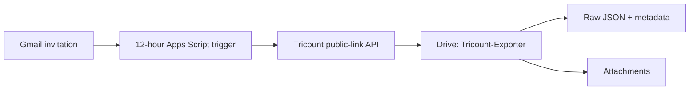

# Google Apps Script installation

## Table of Contents

- [What the installer creates](#what-the-installer-creates)
- [Prerequisites](#prerequisites)
- [Install](#install)
- [Choose an output folder](#choose-an-output-folder)
- [One-time authorization](#one-time-authorization)
- [Verification](#verification)
- [Uninstall](#uninstall)

## What the installer creates



The installer creates a standalone Apps Script project named
`Tricount-Exporter`, a private Drive root of the same name, Script Properties,
and one 12-hour installable trigger. It creates a temporary local 2048-bit RSA
keypair, stores only its public PEM in Script Properties, and removes the
private file before the installer returns.

## Prerequisites

- Node.js, `npx`, `jq`, and OpenSSL.
- A Google account already authorized for `clasp` with access to the Gmail
  mailbox and Drive that should own the exports.
- A private Desktop OAuth client for the Google Cloud project linked to this
  Apps Script project. The public `clasp` OAuth client is blocked for the Gmail
  scope used by this automation.
- In that linked standard Cloud project, enable both the Apps Script API
  (`script.googleapis.com`) and Google Drive API (`drive.googleapis.com`).
- A Tricount invite must reach that mailbox. No share URL is configured or
  committed manually.

## Install

Run from this checkout:

```bash
make apps-script-check
make apps-script-install
```

The installer copies the versioned Apps Script source to private installer
state, creates or updates the remote script, deploys its owner-only execution
entry point, configures Drive and the 12-hour trigger, and leaves the checkout
without a `.clasp.json` or generated key.

On a first interactive install it asks for an output folder, Gmail label,
notification recipient, archive behavior, and interval; pressing Enter accepts
the portable defaults. For unattended setup, create
`config.apps-script.local.json` from the example or pass environment overrides:

```bash
TRICOUNT_EXPORTER_DRIVE_OUTPUT_FOLDER_URL='https://drive.google.com/drive/folders/FOLDER_ID' \
TRICOUNT_EXPORTER_PROCESSED_LABEL_NAME='Tricount-Exporter/Imported' \
TRICOUNT_EXPORTER_NOTIFICATION_EMAIL='owner@example.com' \
TRICOUNT_EXPORTER_ARCHIVE_PROCESSED_THREADS=true \
TRICOUNT_EXPORTER_SEND_SUCCESS_NOTIFICATION=true \
TRICOUNT_EXPORTER_RUN_INTERVAL_HOURS=12 \
TRICOUNT_EXPORTER_NON_INTERACTIVE=1 \
make apps-script-install
```

## Choose an output folder

The default creates or reuses `My Drive/Tricount-Exporter`. Before the first
install, or after installation, an operator can select an existing Drive folder
by setting `drive_output_folder_url` in the ignored
`config.apps-script.local.json` and rerunning `make apps-script-install`:

```json
"drive_output_folder_url": "https://drive.google.com/drive/folders/FOLDER_ID"
```

The supplied folder becomes the export root; title-named Tricount folders and
`tricount-exporter-import-log.csv` are created directly inside it. Use a folder
where the trigger owner can create files and subfolders.

## One-time authorization

Google OAuth consent cannot be bypassed. Create the Desktop OAuth client in
the standard Cloud project linked to the Apps Script project, save its
downloaded JSON outside the checkout, then pass its path for the first install:

```bash
TRICOUNT_EXPORTER_OAUTH_CLIENT_JSON=/secure/path/oauth-client.json \
  make apps-script-install
```

Complete the Google browser consent. The installer stores the refresh token in
ignored private state and uses it for later status, install, and uninstall
commands. Keep the client JSON in Bitwarden or another secret store; it is not
committed. The automation itself does not create a Tricount API key.

## Verification

```bash
make apps-script-status
```

The command reports the Drive root URL and verifies that exactly one managed
trigger is present. The trigger runs as the Google account that created it.

## Uninstall

The safe default removes only the managed trigger and preserves the remote Apps
Script project and Drive exports:

```bash
TRICOUNT_EXPORTER_CONFIRM_UNINSTALL=DELETE make apps-script-uninstall
```
